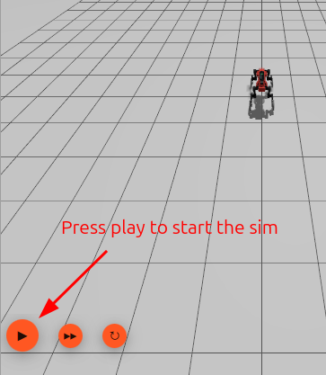
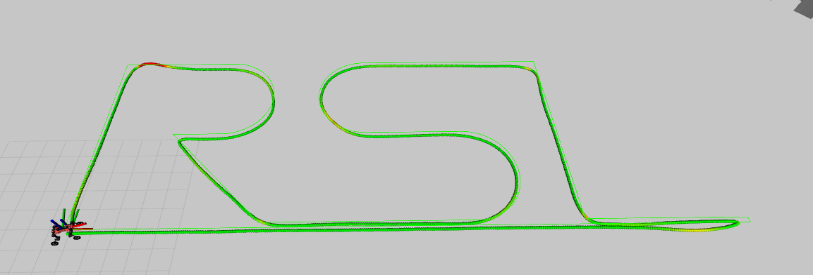
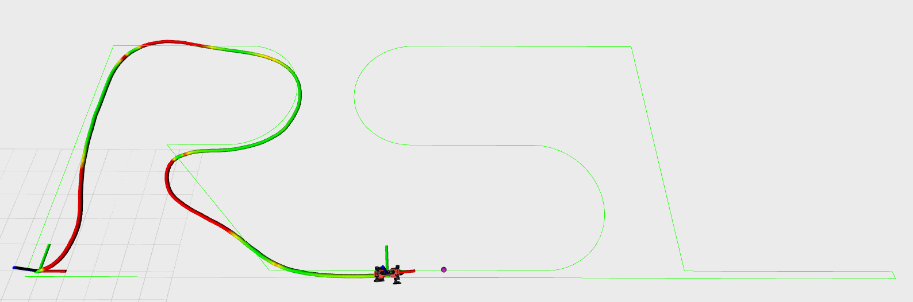

# WLR Competition 2025 - Anymal on Wheels

**Maintainers**: 
- Victor Klemm
- Jiangpeng Hu  
- Per Frivik (pfrivik@ethz.ch)

This repository contains the control framework for the WLR Competition 2025. Participants implement custom controllers for autonomous quadruped robots using neural network policies in a ROS 2 simulation environment.

**Tested with ROS 2 Jazzy on Ubuntu 24.04 LTS.**

## 📋 System Requirements

- Ubuntu 24.04 LTS (recommended)
- ROS 2 Jazzy
- CUDA-capable GPU (optional, for GPU acceleration)

**Don't have Ubuntu 24.04 or ROS 2 Jazzy?** We highly recommend using [Distrobox](https://distrobox.it/) to run the competition framework in a containerized Ubuntu 24.04 environment.

## 🚀 Installation

### 1. ROS 2 Jazzy
Follow the [official installation guide](https://docs.ros.org/en/jazzy/Installation.html).

Install required packages:
```bash
sudo apt install ros-jazzy-ros-gz ros-jazzy-ros-gz-bridge ros-jazzy-ros-gz-sim
```

### 2. Setup Workspace
```bash
mkdir -p ~/wlr_ws/src
cd ~/wlr_ws/src
git clone <repository-url> wlr-competition-2025
cd wlr-competition-2025
```

### 3. LibTorch Setup
```bash
chmod +x setup_libtorch.sh
./setup_libtorch.sh
# Choose CPU (1) or GPU (2) version when prompted
```

**For GPU Support**: If you want to use GPU acceleration, install the CUDA development toolkit first:
```bash
sudo apt install nvidia-cuda-toolkit
```
Then choose option 2 (GPU) when running the setup script. GPU acceleration provides faster neural network inference but is optional for the competition.

### 4. Build
```bash
cd ~/wlr_ws
colcon build --cmake-args -DCMAKE_BUILD_TYPE=Release --symlink-install
source install/setup.bash
```

## 🏗️ Architecture Overview

### Core Components

**Controller Executor** (`aow_controllers/src/controller_executor.cpp`)
- Main execution framework
- Handles observations (joint states, IMU, trajectory)
- Publishes joint commands at 200Hz
- Runs neural network inference at 50Hz

**Base Controller Interface** (`aow_controllers/include/aow_controllers/base_controller.hpp`)
- Abstract base class for all controllers
- Standard interface: `compute_control(observations) -> commands`
- Publishing capabilities for debug visualization

### Example Controllers

- **End2End**: Complete autonomous navigation with neural networks
- **PurePursuit**: Traditional geometric path following 
- **Custom**: Skeleton for your implementation

## 🎮 Getting Started - Try the Examples

Before implementing your own controller, familiarize yourself with the existing examples:

### Test Existing Controllers
```bash
# Launch end-to-end neural network controller
ros2 launch aow_controllers end2end.launch.py

# Launch pure pursuit geometric controller  
ros2 launch aow_controllers pure_pursuit.launch.py
```

### ▶️ How to Run (Click the Play Button!)

After launching your controller as shown above, make sure to click the **play** button in the simulation interface to start the robot. This is a common step that some users miss!

<p align="center">
  
</p>

When you run these launch files, your RViz robot paths should look approximately like the images below:

#### End2End Controller (should NOT fail)
<p align="center">
  
</p>

#### Pure Pursuit Controller (tuned to FAIL for demonstration +5s off track by 1m)
<p align="center">
  
</p>

- The **End2End** controller should complete the trajectory without being eliminated (no "ELIMINATED" message).
- The **Pure Pursuit** controller is intentionally tuned to fail, so you should see the robot get eliminated ("ELIMINATED" message in the scoring panel). This is expected and helps you verify the scoring system.

### Generate Custom Trajectories
Create your own trajectories for testing:
```bash
# Navigate to trajectory generation
cd ~/wlr_ws/src/wlr-competition-2025/aow_controllers/src/trajectory_generation

# Run the trajectory generator
python trajectory_generator.py
```

**Important**: After generating a new trajectory, update the `trajectory_file` parameter in your controller's YAML configuration file to use the new trajectory.

## 📝 Implementation Requirements

Participants must implement the following files in `aow_controllers/src/example_controllers/custom/`:

### 1. Header File (`custom_controller_class.hpp`)
```cpp
class CustomController : public BaseController {
public:
    CustomController(const ControllerConfig& config);
    bool initialize(rclcpp::Node* node) override;
    ControllerOutput compute_control(const ControllerObservations& observations) override;
    // Your additional methods...
};
```

### 2. Implementation File (`custom_controller_class.cpp`)
- Implement `compute_control()` method
- Load your trained PyTorch model if you have one
- Process observations and generate joint commands

### 3. Configuration File (`config/custom_controller_config.yaml`)
```yaml
custom_controller:
  model_path: "path/to/your/model.pt"
  # Your parameters...
```

### 4. Launch File (`launch/custom_controller.launch.py`)
- Launch your controller with proper configuration
- Include Gazebo simulation environment

## 🎯 Quick Start

Test the framework with existing controllers:
```bash
# Launch end-to-end controller
ros2 launch aow_controllers end2end.launch.py

# Launch pure pursuit controller
ros2 launch aow_controllers pure_pursuit.launch.py

# Launch your custom controller (after implementation)
ros2 launch aow_controllers custom_controller.launch.py
```

## 📊 Performance Evaluation

### Time-Based Scoring System

The competition uses a **time integration scoring system** that measures how long it takes your robot to complete the trajectory:

**Score = Integrated Time (seconds)**
- Lower scores are better
- Timer starts when scoring begins and continues until trajectory completion
- Best possible score is the minimum time needed to complete the trajectory

### Elimination Rules

**Path Deviation Penalty**: 
- Robot must stay within **0.3 meters** of the closest waypoint
- **Total accumulated off-path time** is tracked across all off-path episodes
- Robot is **eliminated** if total off-path time exceeds **5.0 seconds**
- Eliminated robots receive a score of **infinity (∞)**

**How is distance to the path calculated?**
- The distance to the path is computed by searching for the closest waypoint among the **next 100 waypoints** ahead of the robot's current position on the trajectory.
- The search always moves **forward** along the trajectory and never goes backward, so the robot cannot be considered closer to a previous part of the path.
- This ensures progress and prevents shortcutting or reversing along the path.

**Example**: If your robot goes off-path multiple times:
- Off-path for 2.1s → back on path
- Off-path for 0.8s → back on path  
- Off-path for 1.5s → back on path
- Off-path for 0.7s → **ELIMINATED** (2.1 + 0.8 + 1.5 + 0.7 = 5.1s total)

### RViz Monitoring

The RViz interface displays real-time scoring information:
- **SCORE**: Current integrated time (or "ELIMINATED (∞)" if eliminated)
- **Off-path Counter**: Shows accumulated off-path time as "X.X/5.0s"
- **Path Visualization**: Color-coded robot path (green = on-path, red = off-path)

### Topics Published

- `/score`: Current score (Float64) - infinity if eliminated
- `/integrated_time`: Raw time elapsed (Float64)
- `/off_path_time`: Total accumulated off-path time (Float64)

Competition ranking will be based on the lowest score (fastest completion time) among non-eliminated robots.

## ⏱️ Lockstep Synchronization

For slower PCs where simulation runs faster than inference (causing control issues), enable lockstep synchronization:

```yaml
# In controller_executor_config.yaml
controller_executor:
  ros__parameters:
    use_lockstep: true    # Enable if simulation outpaces your controller
```

This will pause the gazebo simulation until your inference loop is completed. We set it to true by default and highly recommend that you leave it on too. 

## 🧠 Training Your Own End2End Controller (Optional)

Want to train and improve the neural tracking controller? We provide an IsaacLab training environment:

### 1. Clone IsaacLab Repository
```bash
git clone https://github.com/leggedrobotics/wlr-competition-2025-IsaacLab.git
cd wlr-competition-2025-IsaacLab
```

### 2. Follow IsaacLab Installation
Follow the [installation instructions](https://isaac-sim.github.io/IsaacLab/main/source/setup/installation/index.html#local-installation) in the IsaacLab repository to set up the training environment.

### 3. Install the rsl_rl
```bash
# Clone the rsl_rl repo
cd wlr-competition-2025-IsaacLab
git clone git@github.com:leggedrobotics/rsl_rl.git
cd rsl_rl
# Switch to the related head
git checkout 491ca913df7809b82880d14ad8ac679a3f639a07
# Manually install the rsl_rl
cd ..
./isaaclab.sh -p -m pip install -e ./rsl_rl/
```

### 4. Validate the environment
Run the Dev task with rendering to see if the env is setup successfully:
```bash
./isaaclab.sh -p scripts/reinforcement_learning/rsl_rl/train.py --task=Isaac-Path-Teacher-Anymal-D-Dev-v0
```

### 5. Train End2End Controller
Run the training tasks in sequence (Make sure to have GPU memory > 6000MB):
```bash
# First train the teacher policy
./isaaclab.sh -p scripts/reinforcement_learning/rsl_rl/train.py --task=Isaac-Path-Teacher-Anymal-D-Train-v0 --headless --video

# Then train the student policy
./isaaclab.sh -p scripts/reinforcement_learning/rsl_rl/train.py --task=Isaac-Path-Student-Anymal-D-Train-v0 --headless --video
```

During training, the videos and tensorboard logs will be stored in the `logs/rsl/Path_Tracking_AoW_D`

### 6. Test trained policy
```bash
# Test the teacher policy
./isaaclab.sh -p scripts/reinforcement_learning/rsl_rl/play.py --task=Isaac-Path-Teacher-Anymal-D-Play-v0 --load_run="..."

# Test the student policy
./isaaclab.sh -p scripts/reinforcement_learning/rsl_rl/play.py --task=Isaac-Path-Student-Anymal-D-Play-v0 --load_run="..."
```

**Training Configuration**: `source/isaaclab_tasks/isaaclab_tasks/manager_based/path_tracking/end_to_end/tracking_teacher_env_cfg.py`

You can adapt and modify the training to improve the controller performance for the competition.

## 📦 Submission Guidelines

### What You Can Submit
- **Custom controller files**: `custom_controller_class.hpp` and `custom_controller_class.cpp`
- **Configuration**: `custom_controller_config.yaml` 
- **Launch file**: `custom_controller.launch.py`
- **Build files**: Updated `CMakeLists.txt` and `package.xml` (if needed)
- **External libraries**: You can use any additional libraries you want

### Important Constraints
- **Controller Executor**: You cannot modify `controller_executor.cpp` - only work within your controller class
- **Observations**: You must use only the provided observations from `ControllerObservations` structure
- **Interface**: Your controller must inherit from `BaseController` and implement the standard interface

### Need Changes Outside These Constraints?
If you need modifications to the executor, additional observations, or other framework changes, please contact the maintainer: **pfrivik@ethz.ch**

---

## 🛠️ Troubleshooting

### CUDA Toolkit Error
If you encounter this error during compilation:

```
--- stderr: aow_controllers
CUDA_TOOLKIT_ROOT_DIR not found or specified
CMake Warning at third_party/libtorch/share/cmake/Caffe2/public/cuda.cmake:31 (message):
  Caffe2: CUDA cannot be found.  Depending on whether you are building Caffe2
  or a Caffe2 dependent library, the next warning / error will give you more
  info.
Call Stack (most recent call first):
  third_party/libtorch/share/cmake/Caffe2/Caffe2Config.cmake:87 (include)
  third_party/libtorch/share/cmake/Torch/TorchConfig.cmake:68 (find_package)
  CMakeLists.txt:20 (find_package)

CMake Error at third_party/libtorch/share/cmake/Caffe2/Caffe2Config.cmake:91 (message):
  Your installed Caffe2 version uses CUDA but I cannot find the CUDA
  libraries.  Please set the proper CUDA prefixes and / or install CUDA.
Call Stack (most recent call first):
  third_party/libtorch/share/cmake/Torch/TorchConfig.cmake:68 (find_package)
  CMakeLists.txt:20 (find_package)
```

**Solution**: You have a GPU version of LibTorch but missing CUDA development toolkit. Install it with:

```bash
sudo apt install nvidia-cuda-toolkit nvidia-cuda-dev
```

**Alternative**: If you don't need GPU acceleration, reinstall LibTorch with CPU version:
```bash
cd ~/wlr_ws/src/wlr-competition-2025
./setup_libtorch.sh
# Choose option 1 (CPU) when prompted (script automatically cleans old version)
```

### Other Common Issues
- **Permission denied on setup script**: Make sure it's executable with `chmod +x setup_libtorch.sh`
- **ROS 2 sourcing**: Make sure you source ROS 2 in every terminal: `source /opt/ros/jazzy/setup.bash`
- **Build errors**: Try cleaning and rebuilding with performance mode:
```bash
cd ~/wlr_ws 
rm -rf build install log 
colcon build --symlink-install --cmake-args -DCMAKE_BUILD_TYPE=Release
```

For technical support, contact: **Per Frivik** (pfrivik@ethz.ch)
